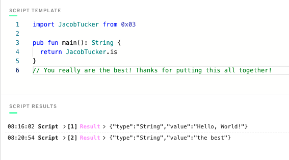
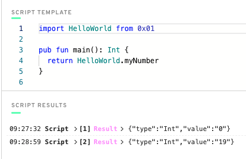
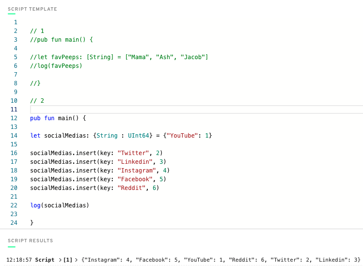

# Ch1 Day 1 - Learning Blockchain Concepts

1. Explain what the Blockchain is in your own words.

   - A blockchain is a distributed network where information can be stored publicly. Users can interact with that information without restriction from centralized authorities. Blockchains typically have certain properties to protect users from scams and fordgery. Inheritly, blockchains allow for users to rely on distributed programming consensus (Math) instead of trusted (centralized) third parties, without compromosing security.

2. Explain what a Smart Contract is.

   - A smart contract is logic deployed to the blockchain that allows users to change the state of data stored on the blockchain.

3. Explain the difference between a script and a transaction.

   - A script allows a user to read information on the blockchain while a transaction allows users to create, update, or delete information on the blockchain. A transaction typically has fees associated with its execution in the form of the blockchains native token. These "gas fees" serve as an incentive to the validators who mantain the integrity of the network.

# Ch1 Day 2 - The Flow Blockchain & Cadence

1. What are the 5 Cadence Programming Language Pillars?

   - Safety and Security
   - Clarity
   - Approachability
   - Developer Experience
   - Resource Oriented Programming

#

2. In your opinion, even without knowing anything about the Blockchain or coding, why could the 5 Pillars be useful (you don't have to answer this for #5)?

   - Of course safety ad security are always top priority bc people value their rights and property.

   - Clarity is important to allow other to easily understand and work on your code, code that only you understand limits the development of your code, because then only you can contribute.

   - Approachability allows for devs to quickly pickup on a language. Shortening the learning process removes a barrier to entry and allows for a growing community, in hopes to make the project a standard.

   - Dev Exp: Devs like easy to debug and understand languages. A balance of control, yet not too much typing is always ideal.

# Ch2 Day 1 - Our First Smart Contract

1. Deploy a contract to account 0x03 called "JacobTucker". Inside that contract, declare a constant variable named is, and make it have type String. Initialize it to "the best" when your contract gets deployed.

2. Check that your variable is actually equals "the best" by executing a script to read that variable. Include a screenshot of the output.

# Ch2 Day 2 - Transactions and Scripts

1. Explain why we wouldn't call changeGreeting in a script.

   - changeGreeting changes the state of the greeting variable in the smart contract. Scripts do not change the state of variables in smart contracts, this functionality is exclusive to transactions.

2. What does the AuthAccount mean in the prepare phase of the transaction?

   - The AuthAccount is the parameter taken into the prepare phase of the transaction. This AuthAccount approves the transaction ("signs it") and pays the gas fees to execute the transaction.

3. What is the difference between the prepare phase and the execute phase in the transaction?

   - The prepare phase accesses the data in the account, like a gatekeeper to approve the manipulation of information. The execute phase can not access data in the account, but it can call functions to actually do the manipulation of the data on the blockchain, after everything checks out in the prepare phase.

4. Add two new things inside your contract:

   1. A variable named myNumber that has type Int (set it to 0 when the contract is deployed)

   2. A function named updateMyNumber that takes in a new number named newNumber as a parameter that has type Int and updates myNumber to be newNumber

   3. Add a script that reads myNumber from the contract

   4. Add a transaction that takes in a parameter named myNewNumber and passes it into the updateMyNumber function. Verify that your number changed by running the script again.

# Ch2 Day 3 - Arrays, Dictionaries, and Optionals

1. In a script, initialize an array (that has length == 3) of your favourite people, represented as Strings, and log it.

2. In a script, initialize a dictionary that maps the Strings Facebook, Instagram, Twitter, YouTube, Reddit, and LinkedIn to a UInt64 that represents the order in which you use them from most to least. For example, YouTube --> 1, Reddit --> 2, etc. If you've never used one before, map it to 0!

3. Explain what the force unwrap operator "!" does, with an example different from the one I showed you (you can just change the type).

   - The force unwrap operator changes the type from a type optional (ex Bool?) to just the type (Bool)

4. Using this picture below, explain...

- What the error message means

  - The error message means the compiler was expecting a type optional (String or nil) but got the type (String)

- Why we're getting this error

  - We're getting this error because the value of "thing[0x03]" is a String optional not a String. The return value needs a force unwrapper to provide the expected return value.

- How to fix it

  - The way to fix this, is to force unwrap the return value by adding the force unwrap operator "thing[0x03]!"

# Ch2 Day 4 - Basic Structs

1.  Deploy a new contract that has a Struct of your choosing inside of it (must be different than Profile).

2.  Create a dictionary or array that contains the Struct you defined.

3.  Create a function to add to that array/dictionary.

        access(all) contract Dealership {

            pub var cars: {Address: Car}

            pub struct Car {
                pub let make: String
                pub let model: String
                pub let year: String
                pub let account: Address

                init(_make: String, _model: String, _year: String, _account: Address){
                self.make = _make
                self.model = _model
                self.year = _year
                self.account = _account
                }

            }

            pub fun addCar(make: String, model: String, year: String, account: Address){
                let newCar = Car(_make:make, _model:model, _year:year, _account:account)
                self.cars[account] = newCar
            }

            init() {
                self.cars = {}
            }
        }

4.  Add a transaction to call that function in step 3.

        import Dealership from 0x02

        transaction(make: String, model: String, year: String, account: Address) {
            prepare(signer: AuthAccount) {}

            execute {
            Dealership.addCar(make: make, model: model, year: year, account: account)
            }
        }

5.  Add a script to read the Struct you defined.

        import Dealership from 0x02

        pub fun main(account: Address): Dealership.Car {
            return Dealership.cars[account]!
        }

# Ch3 Day 1 - Intro to Resources

1.  In words, list 3 reasons why structs are different from resources.

    - Structs can be overwritten, copied, and created anytime. Resources can not be overwritten or copied and must be accounted for at all times.

2.  Describe a situation where a resource might be better to use than a struct.

    - An NFT is the perfect situation. To be more specific, the title of a car would be a good resource.

3.  What is the keyword to make a new resource?

    - Create

4.  Can a resource be created in a script or transaction (assuming there isn't a public function to create one)?

    - Definetly not a script because scripts can only view data. If there isn't a public function to create the resource, only the contract can create a resource with the create keyword.

5.  What is the type of the resource below?

    - @Jacob

6.  Let's play the "I Spy" game from when we were kids. I Spy 4 things wrong with this code. Please fix them.

        pub contract Test {

            pub resource Jacob {
                pub let rocks: Bool
                init() {
                    self.rocks = true
                }
            }

            pub fun createJacob(): @Jacob {
                let myJacob <- create Jacob()
                return <- myJacob
            }

        }

# Ch 3 Day 2 - Resources in Dictionaries & Arrays

1.  Write your own smart contract that contains two state variables: an array of resources, and a dictionary of resources. Add functions to remove and add to each of them. They must be different from the examples above.

        access(all) contract NbaStar {

            pub var allStars : @[Player]
            pub var allStarDict: @{String:Player}

            pub resource Player{
                pub let name: String
                init(){
                    self.name = "Luka"
                }
            }

            //array logic
            pub fun addAllStar(player: @Player){
                self.allStars.append(<- player)
            }

            pub fun removeAllStar(index: Int): @Player {
                return <- self.allStars.remove(at: index)
            }

            pub fun addAllStarDict(player: @Player){
                let key = player.name
                self.allStarDict[key] <-! player
            }

            //dict logic
            pub fun removeAllStarDict(key: String): @Player {
                let player <- self.allStarDict.remove(key: key)!
                return <- player
            }

            init() {
                self.allStars <- []
                self.allStarDict <- {}
            }

        }
